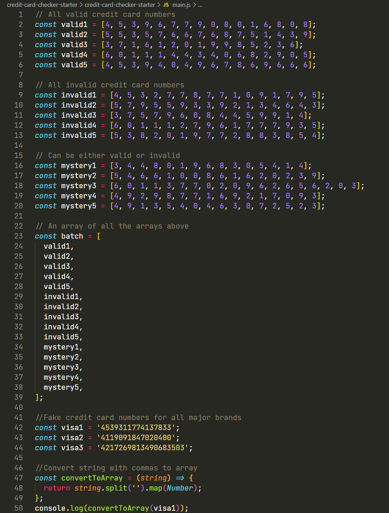
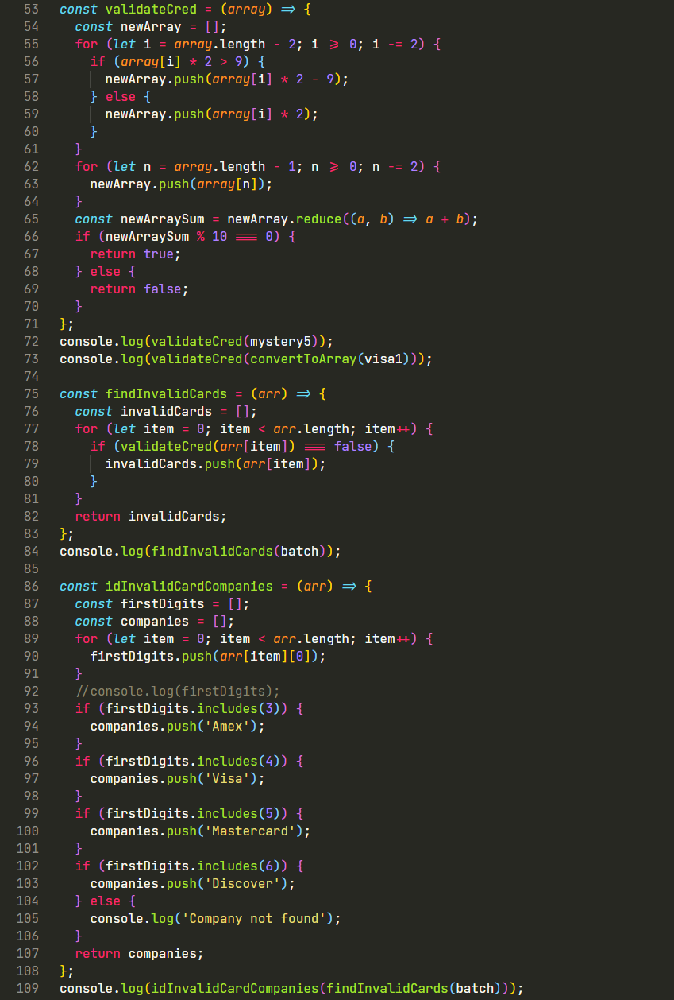

# Credit Card Checker

## Table of Contents

- [Project Goals](#project-goals)
- [General Info](#general-information)
- [Technologies Used](#technologies-used)
- [Screenshots](#screenshots)
- [Project Status](#project-status)
- [Contact](#contact)

## Project Goals

- Context: The company that you work for suspects that credit card distributors have been mailing out cards that have invalid numbers. In this project, you have the role of a clerk who checks if credit cards are valid. Every other clerk currently checks using pencil and paper, but you’ll be optimizing the verification process using your knowledge of functions and loops to handle multiple credit cards at a time. Unlike the other clerks, you can spend the rest of your time relaxing!

## General Information

To find out if a credit card number is valid or not, use the [_Luhn algorithm_](https://en.wikipedia.org/wiki/Luhn_algorithm#Description). Generally speaking, an algorithm is a series of steps that solve a problem — the Luhn algorithm is a series of mathematical calculations used to validate certain identification numbers, e.g. credit card numbers. The calculations in the Luhn algorithm can be broken down as the following steps:

1. Starting from the farthest digit to the right, AKA the check digit, iterate to the left.
2. As you iterate to the left, every other digit is doubled (the check digit is not doubled). If the number is greater than 9 after doubling, subtract 9 from its value.
3. Sum up all the digits in the credit card number.
4. If the sum modulo 10 is 0 (if the sum divided by 10 has a remainder of 0) then the number is valid, otherwise, it’s invalid.

## Technologies Used

- JavaScript.

## Screenshots

## Project Status

Project is: _complete_.

## Contact

Created by Mykhailo.
